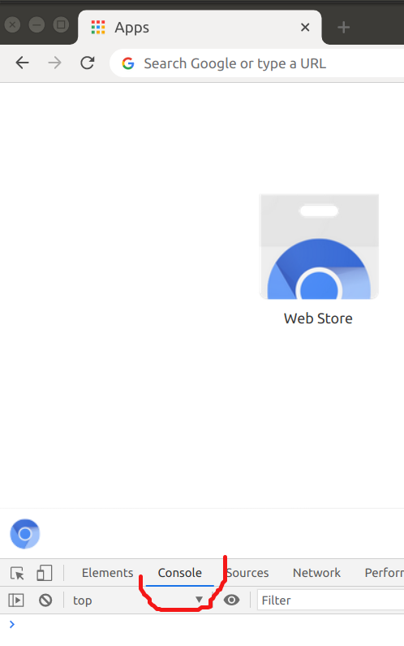
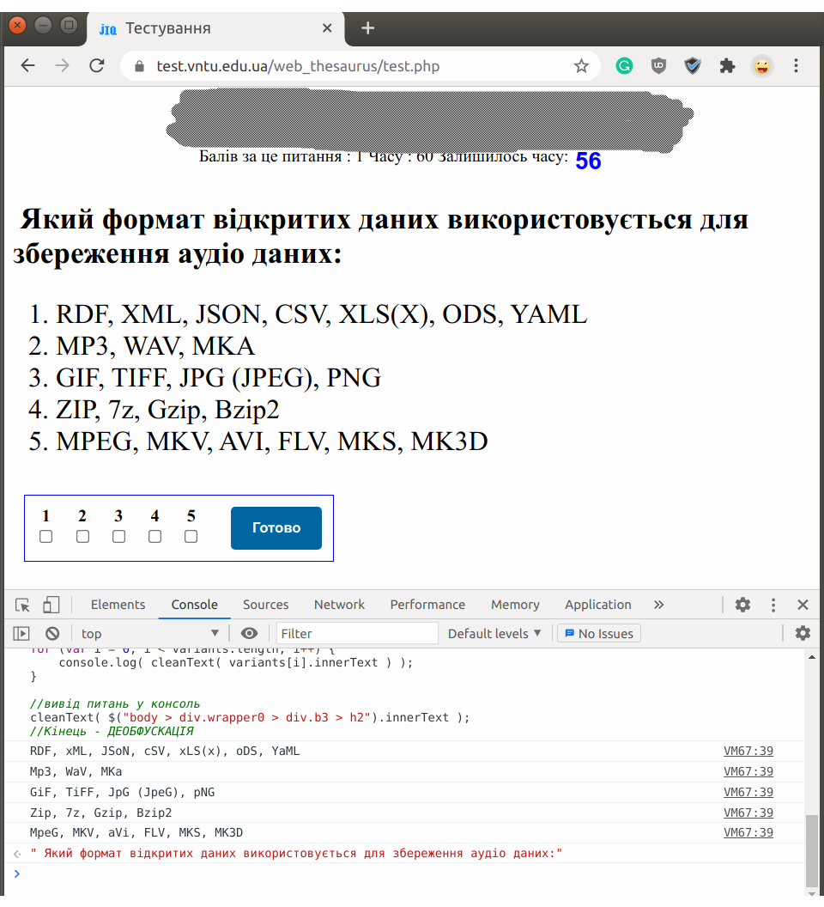

# Хелпер
Для проходження тестів.

Відключає зайвий функціонал:
 - таймер (зупитяється локально у браузері, але якщо довго не давати відповіді, то сервер зрозуміє, що користувач хитрує і не прийме відповідь)
 - заборону перемикання таба
 - заборону копіювати текст
 - деобфускує текст(щоб текст запитання можна було гуглити)

# Що таке обфускація 
Тестова система бере текст питання кирилицею, наприклад:

 **"Мій тест"**

 І замінює деякі літери на англійські:

**"Мiй тecт"**

У прикладі виже замінив кириличні символи 'і', 'с', 'e'.
Для людини такі зміни непомітні. Але гугл не зморже шукати. Якщо запрос короткий, гугл випарвить, але якщо
буде велике речення, то гугл виправити не може. 
Тому цей скрипт робить деобфускацію. 

 
# Вимоги до браузера і оточення, 
Протестовано на браузері Сhrome/Chromium
Найзручніше із мишкою клавіатурою і другим монітором, на одному моніторі тест, в інщому гугл

# Інструкція із використання
1. Відкрити в Chrome/Chromium нову вкладку, натиснути на клавіатурі F12, відкриєть знизу панель
2. У цій панелі перейти на вкладку "Консоль"
<picture>
  
</picture>

3. Скопіювати код із файлу: 
    [consoleHelper.js](ToolForChromeConsole/consoleHelper.js)
4. Почати проходити тест

5. Коли питання відкрилось, вставити код в консоль, і виконати його(натиснути Enter).
Це зупиняє таймер, і виводить в консоль деобфускований текст. 
Код виконувати потрібно на кожному питанні. 
Консоль запам"ятовує історію виконаних команд(коду), не потрібно щоразу його копіювати, 
коли перемикається питання, потрібно натиснути на клавіатурі кнопку "стрілка вгору", і натиснути Enter
Приклад:
<picture>
  
</picture>

6. В консоль виведено деобфускований текст. Можете його копіювати. Enjoy )