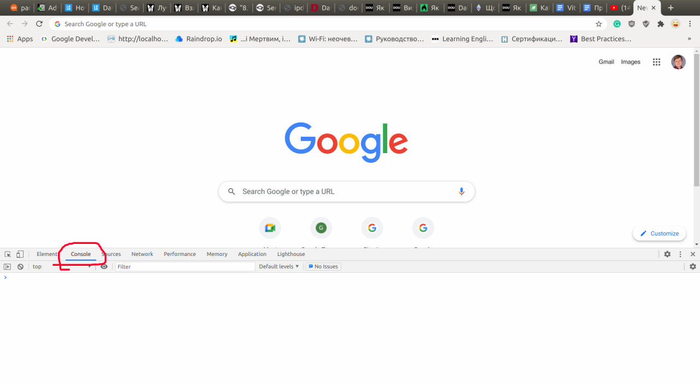

# Хелпер
Для проходження тестів.

Відключає зайвий функціонал:
 - таймер
 - заборону перемикання таба
 - заборону копіювати текст
 - деобфускує текст(щоб текст запитання можна було гуглити)
 
# Інструкція із використання
Протестовано на брауері Сhrome/Chromium

# Інструкція із використання
1. Відкрити в Chrome/Chromium нову вкладку, натиснути на клавіатурі F12, відкриєть знизу панель
2. У цій панелі перейти на вкладку "Консоль"
<picture>
  
</picture>

3. Почати проходити тест
4. Скопіювати ось цей код: 
    [clipboardAndStoptimer.js](clipboardAndStoptimer.js)
